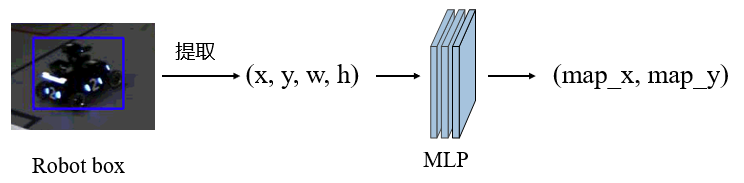
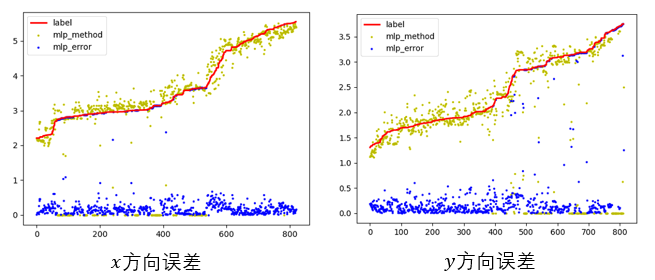

## 算法目的

根据哨兵相机高度和俯仰角固定，以及平面假设，在哨兵视角下的图像坐标会与世界坐标一一对应，利用神经网络来拟合相机坐标系到世界坐标系的转换矩阵，模型为三层的MLP结构，将机器人的box检测框映射为世界地图坐标

## 算法流程

如图所示，从 Yolo 检测到的 Robot box 中提取 (x, y, w, h), 其中 $(x, y)$选择为 box 下界中心点位置，是因为选择正中心会受到车体远近box大小问题影响，$(w, h)$为box的宽和高，通过MLP将图像坐标映射为实际坐标，这种方法依赖于yolo检测bounding box的精度。

## 误差分析

MLP方法整体拟合的很好，方差很小，但是有个不足，就是模型的输出会在某些位置产生奇异值（超出边界）

## 运行效果图

## 文件目录说明

`pretrain_model`下保存着已经训练好的模型

`tran.py`重新训练模型要先新建一个`model`目录，会把新的模型放在里面

训练过程会以`tensorboard`方式保存在`result`目录
